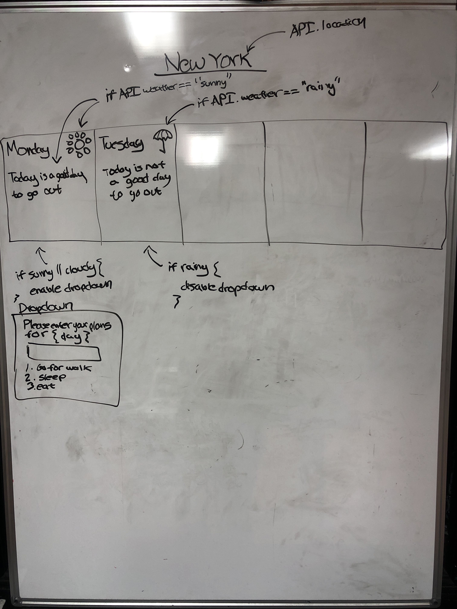

#  
# GoNoGo

### User Stories

This is web app that aims to give the public the ability to quickly make a 
decision about whether to go out or not by providing a one-glance weather 
report.

### Minimum Viable Product

* Multiple React Components
* Conditional Rendering using State/Props
* Component Lifecycle Methods
* Javascript Event Handling
* Routing using React-Router
* Project Management via **[Trello](https://trello.com/b/IhoPMteL/gonogo)** 
* GET data using OpenWeatherMap API
* Promises/Asynchronous Methods (Async-Await)
* Responsive styling

### Wireframe

### Technologies used

* **React** To build the user interface and its components
* **Axios** For making HTTP requests to fetch API data

### Installation Instructions
* An OpenWeatherMap API key is required to run this application (App.js:12)

---

### Link to Deployed Site

* **[GoNoGo](https://go-no-go.herokuapp.com/)** 

---
